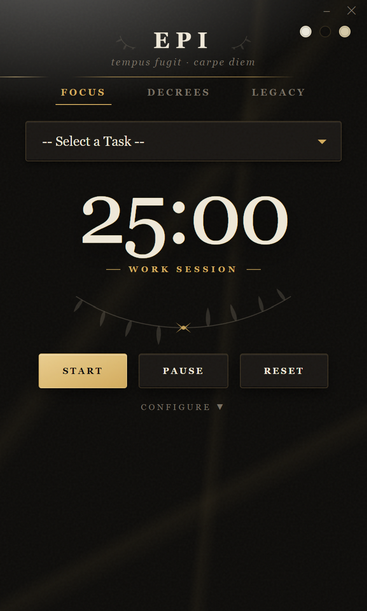
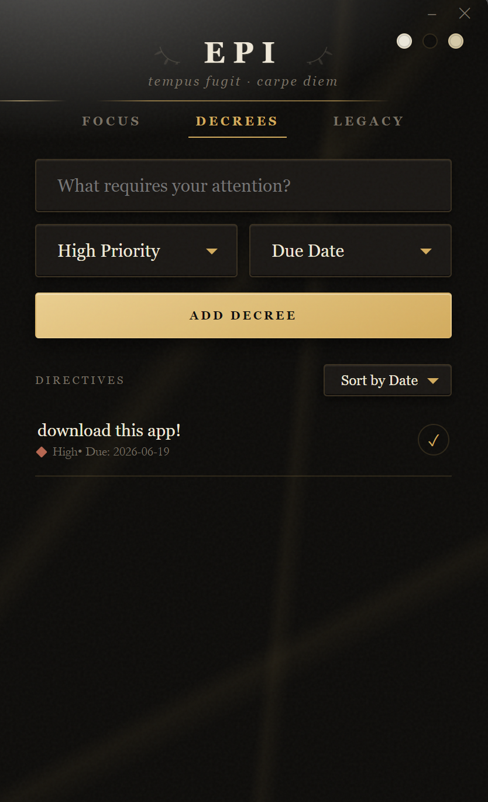
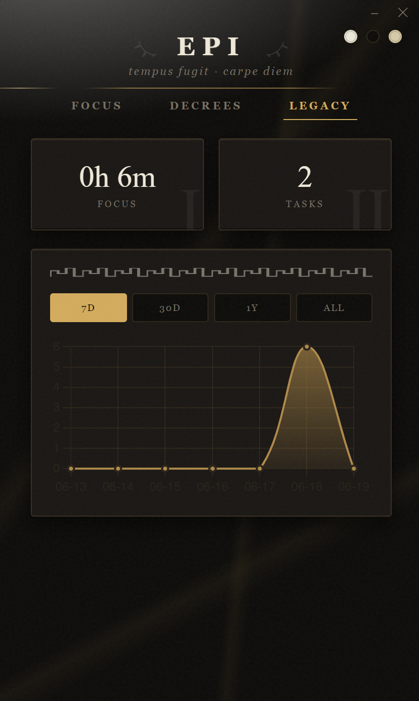

<div align="center">
  
  <h1>EPI · Classical Focus</h1>
  <p>A Pomodoro timer and task tracker with a Roman/Platonic aesthetic.<br>Built with Electron. Fully offline.</p>
</div>

---

<div align="center">
  
  &nbsp;&nbsp;
  
  &nbsp;&nbsp;
  
</div>

---

## Features

- **Pomodoro timer** — work, short break, and long break modes with auto-transition. Configurable durations.
- **Laurel wreath progress** — eight leaves fill with gold as you complete sessions in a 4-pomodoro cycle. Earn them.
- **Task tracker** — add tasks with priority (High / Medium / Low) and a due date. Sort by date or priority. Mark complete.
- **Focus stats** — total hours focused, tasks completed, and a chart broken down by 7 days / 30 days / 1 year / all time.
- **Three themes** — Marble (warm cream), Obsidian (near-black), Parchment (terracotta on aged tan).
- **Fully offline** — no network calls at runtime. Fonts are self-hosted. Data is stored locally via `electron-store`.
- **Frameless window** — custom minimize / close controls, draggable title area. No OS chrome.

## Install

**Prerequisites:** [Node.js](https://nodejs.org) (v18+) and npm.

```bash
git clone 'repository link'
cd epi
npm install
```

## Run

```bash
npm start
```

## Build a distributable

```bash
npm run build
```

Output goes to `dist/`. Targets Windows, macOS, and Linux via `electron-builder`.

## Structure

```
epi/
├── main.js          # Electron main process — window config, IPC handlers
├── renderer.js      # All UI logic — timer, tasks, charts, custom widgets
├── index.html       # Layout, CSS design system, three theme palettes
├── fonts/           # Self-hosted woff2 — Cinzel, Playfair Display, EB Garamond
└── package.json
```

The entire app is three files and a fonts folder. No framework, no bundler, no build step to run the source.

## Design

Typography: **Cinzel** for inscriptional labels, **Playfair Display** for the timer and stat numerals, **EB Garamond** for body text. Palette tokens are scoped per theme using CSS custom properties — swap a body class and every color updates at once.

The custom dropdowns and date picker replace native OS popups (which can't be themed) with fully styled equivalents that proxy hidden `<select>` and `<input>` elements, so all existing JS logic reads them normally.

## License

MIT — see [LICENSE](LICENSE).
